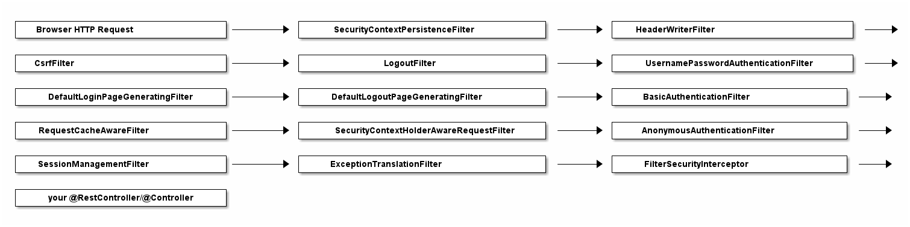

### 1. Authentication

First off, if you are running a typical (web) application, you need your users to *authenticate*. That means your application needs to verify if the user is *who* he claims to be, typically done with a username and password check.

**User**: "I’m the president of the United States. My `*username*` is: potus!"

**Your webapp**: "Sure sure, what’s your `*password*` then, Mr. President?"

**User**: "My password is: th3don4ld".

**Your webapp**: "Correct. Welcome, Sir!"

### 2. Authorization

In simpler applications, authentication might be enough: As soon as a
 user authenticates, she can access every part of an application.

But most applications have the concept of permissions (or roles). 
Imagine: customers who have access to the public-facing frontend of your
 webshop, and administrators who have access to a separate admin area.

Both type of users need to login, but the mere fact of authentication
 doesn’t say anything about what they are allowed to do in your system. 
Hence, you also need to check the permissions of an authenticated user, 
i.e. you need to *authorize* the user.

**User**: "Let me play with that nuclear football…​."

**Your webapp**: "One second, I need to check your `*permissions*` first…​..yes Mr. President, you have the right clearance level. Enjoy."

**User**: "What was that red button again…​??"

### 3. Servlet Filters

Last but not least, let’s have a look at Servlet Filters. What do 
they have to do with authentication and authorization? (If you are 
completely new to Java Servlets or Filters, I advise you to read the 
old, but still very valid [Head First Servlets](http://shop.oreilly.com/product/9780596005405.do) book.)

#### Why use Servlet Filters?

Think back to my [other article](https://www.marcobehler.com/guides/spring-framework), where we found out that basically any Spring web application is *just* one servlet: Spring’s good old [DispatcherServlet](https://docs.spring.io/spring/docs/current/spring-framework-reference/web.html#mvc-servlet), that redirects incoming HTTP requests (e.g. from a browser) to your @Controllers or @RestControllers.

The thing is: There is no security hardcoded into that 
DispatcherServlet and you also very likely don’t want to fumble around 
with a raw HTTP Basic Auth header in your @Controllers. Optimally, the 
authentication and authorization should be done *before* a request hits your @Controllers.

Luckily, there’s a way to do exactly this in the Java web world: you can put [filters](https://www.oracle.com/technetwork/java/filters-137243.html) *in front* of servlets, which means you could think about writing a SecurityFilter
 and configure it in your Tomcat (servlet container/application server) 
to filter every incoming HTTP request before it hits your servlet.

#### FilterChains

Reality Check: While the above code works compiles, it would sooner or later lead to one monster filter with a 
ton of code for various authentication and authorization mechanisms.

In the real-world, however, you would split this one filter up into *multiple* filters, that you then *chain* together.

For example, an incoming HTTP request would…​

1. First, go through a LoginMethodFilter…​

2. Then, go through an AuthenticationFilter…​

3. Then, go through an AuthorizationFilter…​

4. Finally, hit your servlet.

This concept is called *FilterChain* and the last method call in your filter above is actually delegating to that very chai

```java
chain.doFilter(request, response);
```

### Spring’s DefaultSecurityFilterChain

Let’s assume you [set up Spring Security](https://www.marcobehler.com/guides/spring-security#spring-security-dependencies) correctly and then boot up your web application. If you expand that one line into a list, it looks like Spring Security does not just install *one* filter, instead it installs a whole filter chain consisting of 15 (!) different filters.

So, when an HTTPRequest comes in, it will go through *all* these 15 filters, before your request finally hits your @RestControllers. The order is important, too, starting at the top of that list and going down to the bottom.




### Analyzing Spring’s FilterChain

It would go too far to have a detailed look at every filter of this 
chain, but here’s the explanations for a few of those filters. Feel free
 to look at [Spring Security’s source code](https://github.com/spring-projects/spring-security) to understand the other filters.

- **BasicAuthenticationFilter**: Tries to find a Basic 
  Auth HTTP Header on the request and if found, tries to authenticate the 
  user with the header’s username and password.

- **UsernamePasswordAuthenticationFilter**: Tries to find a username/password request parameter/POST body and if found, tries to authenticate the user with those values.

- **DefaultLoginPageGeneratingFilter**: Generates a login 
  page for you, if you don’t explicitly disable that feature. THIS filter 
  is why you get a default login page when enabling Spring Security.

- **DefaultLogoutPageGeneratingFilter**: Generates a logout page for you, if you don’t explicitly disable that feature.

- **FilterSecurityInterceptor**: Does your authorization.

So with these couple of filters, Spring Security provides you a 
login/logout page, as well as the ability to login with Basic Auth or 
Form Logins, as well as a couple of additional goodies like the 
CsrfFilter, that we are going to have a look at later.

**Half-Time Break**: Those filters, for a large part, *are* Spring Security. Not more, not less. They do all the work. What’s left for you is to *configure* how they do their work, i.e. which URLs to protect, which to ignore and what database tables to use for authentication.

Hence, we need to have a look at how to configure Spring Security, next.

### How to configure Spring Security: WebSecurityConfigurerAdapter

With the latest Spring Security and/or Spring Boot versions, the way to configure Spring Security is by having a class that:

1. Is annotated with @EnableWebSecurity.

2. Extends WebSecurityConfigurer, which basically offers you a 
   configuration DSL/methods. With those methods, you can specify what URIs in your application to protect or what exploit protections to enable/disable.

Here’s what a typical WebSecurityConfigurerAdapter looks like:

```java
@Configuration
@EnableWebSecurity // (1)
public class WebSecurityConfig extends WebSecurityConfigurerAdapter { // (1)

  @Override
  protected void configure(HttpSecurity http) throws Exception {  // (2)
      http
        .authorizeRequests()
          .antMatchers("/", "/home").permitAll() // (3)
          .anyRequest().authenticated() // (4)
          .and()
       .formLogin() // (5)
         .loginPage("/login") // (5)
         .permitAll()
         .and()
      .logout() // (6)
        .permitAll()
        .and()
      .httpBasic(); // (7)
  }
}
```

1. A normal Spring @Configuration with the @EnableWebSecurity annotation, extending from WebSecurityConfigurerAdapter.

2. By overriding the adapter’s configure(HttpSecurity) method, you get a
   nice little DSL with which you can configure your FilterChain.

3. All requests going to `*/*` and `*/home*` are allowed (permitted) - the user does *not* have to authenticate. You are using an [antMatcher](https://docs.spring.io/spring-framework/docs/current/javadoc-api/org/springframework/util/AntPathMatcher.html), which means you could have also used wildcards (*, \*\*, ?) in the string.

4. Any other request needs the user to be authenticated *first*, i.e. the user needs to login.

5. You are allowing form login (username/password in a form), with a custom loginPage (`*/login*`,
   i.e. not Spring Security’s auto-generated one). Anyone should be able 
   to access the login page, without having to log in first (permitAll; 
   otherwise we would have a Catch-22!).

6. The same goes for the logout page

7. On top of that, you are also allowing Basic Auth, i.e. sending in an HTTP Basic Auth Header to authenticate.

#### How to use Spring Security’s configure DSL

It takes some time getting used to that DSL, but you’ll find more examples in the FAQ section: [AntMatchers: Common Examples](https://www.marcobehler.com/guides/spring-security#security-examples).

What is important for now, is that *THIS* `*configure*` method is where you specify:

1. What URLs to protect (authenticated()) and which ones are allowed (permitAll()).

2. Which authentication methods are allowed (formLogin(), httpBasic()) and how they are configured.

3. In short: your application’s complete security configuration.

**Note**: You wouldn’t have needed to immediately 
override the adapter’s configure method, because it comes with a pretty 
reasonable implementation - by default. This is what it looks like:

```java
public abstract class WebSecurityConfigurerAdapter implements
        WebSecurityConfigurer<WebSecurity> {

    protected void configure(HttpSecurity http) throws Exception {
            http
                .authorizeRequests()
                    .anyRequest().authenticated()  // (1)
                    .and()
                .formLogin().and()   // (2)
                .httpBasic();  // (3)
        }
}
```

1. To access *any* URI (`*anyRequest()*`) on your application, you need to authenticate (authenticated()).

2. Form Login (`*formLogin()*`) with default settings is enabled.

3. As is HTTP Basic authentication (`*httpBasic()*`).

*This* default configuration is why your application is on lock-down, as soon as you add Spring Security to it. Simple, isn’t it?

#### Summary: WebSecurityConfigurerAdapter’s DSL configuration

We learned that Spring Security consists of a couple of filters that 
you configure with a WebSecurityConfigurerAdapter @Configuration class.

But there’s one crucial piece missing. Let’s take Spring’s 
BasicAuthFilter for example. It can extract a username/password from an 
HTTP Basic Auth header, but what does it *authenticate* these credentials against?

This naturally leads us to the question of how authentication works with Spring Security.

## Authentication with Spring Security

When it comes to authentication and Spring Security you have roughly three scenarios:

1. The **default**: You *can* access the (hashed) password of the user, because you have his details (username, password) saved in e.g. a database table.

2. **Less common**: You *cannot* access the (hashed) password of the user. This is the case if your users and passwords are stored *somewhere* else, like in a 3rd party identity management product offering REST services for authentication. Think: [Atlassian Crowd](https://www.atlassian.com/software/crowd).

3. **Also popular**: You want to use OAuth2 or "Login with 
   Google/Twitter/etc." (OpenID), likely in combination with JWT. Then none
   of the following applies and you should go straight to the [OAuth2 chapter](https://www.marcobehler.com/guides/spring-security#oauth2).

**Note**: Depending on your scenario, you need to 
specify different @Beans to get Spring Security working, otherwise 
you’ll end up getting pretty confusing exceptions (like a 
NullPointerException if you forgot to specify the PasswordEncoder). Keep
 that in mind.

Let’s have a look at the top two scenarios.

### 1. UserDetailsService: Having access to the user’s password

Imagine you have a database table where you store your users. It has a
 couple of columns, but most importantly it has a username and password 
column, where you store the user’s hashed(!) password.

```sql
create table users (id int auto_increment primary key, username varchar(255), password varchar(255));
```

In this case Spring Security needs you to define two beans to get authentication up and running.

1. A UserDetailsService.

2. A PasswordEncoder.

Specifying a UserDetailsService is as simple as this:

```java
@Bean
public UserDetailsService userDetailsService() {
    return new MyDatabaseUserDetailsService(); // (1)
}
```

1. MyDatabaseUserDetailsService implements UserDetailsService, a very 
   simple interface, which consists of one method returning a UserDetails 
   object:

```java
public class MyDatabaseUserDetailsService implements UserDetailsService {

    UserDetails loadUserByUsername(String username) throws UsernameNotFoundException { // (1)
         // 1. Load the user from the users table by username. If not found, throw UsernameNotFoundException.
         // 2. Convert/wrap the user to a UserDetails object and return it.
        return someUserDetails;
    }
}

public interface UserDetails extends Serializable { // (2)

    String getUsername();

    String getPassword();

    // <3> more methods:
    // isAccountNonExpired,isAccountNonLocked,
    // isCredentialsNonExpired,isEnabled
}
```

1. A UserDetailsService loads UserDetails via the user’s username. Note that the method takes **only** one parameter: username (not the password).

2. The UserDetails interface has methods to get the (hashed!) password and one to get the username.

3. UserDetails has even more methods, like is the account active or 
   blocked, have the credentials expired or what permissions the user has -
   but we won’t cover them here.

So you can either implement these interfaces yourself, like we did above, or use existing ones that Spring Security provides.

#### Off-The-Shelf Implementations

Just a quick note: You can always implement the UserDetailsService and UserDetails interfaces yourself.

But, you’ll also find off-the-shelf implementations by Spring Security that you can use/configure/extend/override instead.

1. **JdbcUserDetailsManager**, which is a JDBC(database)-based UserDetailsService. You can configure it to match your *user* table/column structure.

2. **InMemoryUserDetailsManager**, which keeps all userdetails in-memory and is great for testing.

3. **org.springframework.security.core.userdetail.User**, 
   which is a sensible, default UserDetails implementation that you could 
   use. That would mean potentially mapping/copying between your 
   entities/database tables and this user class. Alternatively, you could 
   simply make your entities implement the UserDetails interface.

#### Full UserDetails Workflow: HTTP Basic Authentication

Now think back to your HTTP Basic Authentication, that means you are 
securing your application with Spring Security and Basic Auth. This is 
what happens when you specify a UserDetailsService and try to login:

1. Extract the username/password combination from the HTTP Basic Auth 
   header in a filter. You don’t have to do anything for that, it will 
   happen under the hood.

2. Call *your* MyDatabaseUserDetailsService to load the 
   corresponding user from the database, wrapped as a UserDetails object, 
   which exposes the user’s hashed password.

3. Take the extracted password from the HTTP Basic Auth header, hash it *automatically* and compare it with the hashed password from your UserDetails object. If both match, the user is successfully authenticated.

That’s all there is to it. But hold on, *how* does Spring Security hash the password from the client (step 3)? With what algorithm?

#### PasswordEncoders

Spring Security cannot magically guess your preferred password 
hashing algorithm. That’s why you need to specify another @Bean, a *PasswordEncoder*.
If you want to, say, use the BCrypt password hashing function (Spring Security’s default) for *all your passwords*, you would specify this @Bean in your SecurityConfig.

```java
@Bean
public BCryptPasswordEncoder bCryptPasswordEncoder() {
    return new BCryptPasswordEncoder();
}
```

What if you have *multiple* password hashing algorithms, 
because you have some legacy users whose passwords were stored with MD5 
(don’t do this), and newer ones with Bcrypt or even a third algorithm 
like SHA-256? Then you would use the following encoder:

```java
@Bean
public PasswordEncoder passwordEncoder() {
    return PasswordEncoderFactories.createDelegatingPasswordEncoder();
}
```

How does this delegating encoder work? It will look at the 
UserDetail’s hashed password (coming from e.g. your database table), 
which now has to start with a `*{prefix}*`. That prefix, is your hashing method! Your database table would then look like this:

|     |     |     |
| --- | --- | --- |Table 1. Users Table   
| username | password |     |
| [john@doe.com](mailto:john@doe.com) | {bcrypt}$2y$12$6t86Rpr3llMANhCUt26oUen2WhvXr/A89Xo9zJion8W7gWgZ/zA0C |     |
| [my@user.com](mailto:my@user.com) | {sha256}5ffa39f5757a0dad5dfada519d02c6b71b61ab1df51b4ed1f3beed6abe0ff5f6 |     |

Spring Security will:

1. Read in those passwords and strip off the prefix ( {bcrypt} or {sha256} ).

2. Depending on the prefix value, use the correct PasswordEncoder (i.e. a BCryptEncoder, or a SHA256Encoder)

3. Hash the incoming, raw password with that PasswordEncoder and compare it with the stored one.

That’s all there is to PasswordEncoders.

#### Summary: Having access to the user’s password

The takeaway for this section is: if you are using Spring Security and have access to the user’s password, then:

1. Specify a UserDetailsService. Either a custom implementation or use and configure one that Spring Security offers.

2. Specify a PasswordEncoder.

That is Spring Security authentication in a nutshell.

### 2. AuthenticationProvider: Not having access to the user’s password

Now, imagine that you are using [Atlassian Crowd](https://www.atlassian.com/software/crowd) for centralized identity management. That means all your users and 
passwords for all your applications are stored in Atlassian Crowd and 
not in your database table anymore.

This has two implications:

1. You do *not have* the user passwords anymore in your application, as you cannot ask Crowd to just give you those passwords.

2. You do, however, have a REST API that you can login against, with your username and password. (A POST request to the `*/rest/usermanagement/1/authentication*` REST endpoint).

If that is the case, you cannot use a UserDetailsService anymore, instead you need to implement and provide an **AuthenticationProvider** @Bean.

```java
    @Bean
    public AuthenticationProvider authenticationProvider() {
        return new AtlassianCrowdAuthenticationProvider();
    }
```

An AuthenticationProvider consists primarily of one method and a naive implementation could look like this:

```java
public class AtlassianCrowdAuthenticationProvider implements AuthenticationProvider {

        Authentication authenticate(Authentication authentication)  // (1)
                throws AuthenticationException {
            String username = authentication.getPrincipal().toString(); // (1)
            String password = authentication.getCredentials().toString(); // (1)

            User user = callAtlassianCrowdRestService(username, password); // (2)
            if (user == null) {                                     // (3)
                throw new AuthenticationException("could not login");
            }
            return new UserNamePasswordAuthenticationToken(user.getUsername(), user.getPassword(), user.getAuthorities()); // (4)
        }
        // other method ignored
}
```

1. Compared to the UserDetails load() method, where you only had access 
   to the username, you now have access to the complete authentication 
   attempt, *usually* containing a username and password.

2. You can do whatever you want to authenticate the user, e.g. call a REST-service.

3. If authentication failed, you need to throw an exception.

4. If authentication succeeded, you need to return a fully initialized 
   UsernamePasswordAuthenticationToken. It is an implementation of the 
   Authentication interface and needs to have the field authenticated be 
   set to true (which the constructor used above will automatically set). 
   We’ll cover authorities in the next chapter.

#### Full AuthenticationProvider Workflow: HTTP Basic Authentication

Now think back to your HTTP Basic Authentication, that means you are 
securing your application with Spring Security and Basic Auth. This is 
what happens when you specify an AuthenticationProvider and try to 
login:

1. Extract the username/password combination from the HTTP Basic Auth 
   header in a filter. You don’t have to do anything for that, it will 
   happen under the hood.

2. Call *your* AuthenticationProvider (e.g. 
   AtlassianCrowdAuthenticationProvider) with that username and password 
   for you to do the authentication (e.g. REST call) yourself.

There is no password hashing or similar going on, as you are 
essentially delegating to a third-party to do the actual 
username/password check. That’s AuthenticationProvider authentication in
 a nutshell!

#### Summary: AuthenticationProvider

The takeaway for this section is: if you are using Spring Security and *do not* have access to the user’s password, then *implement and provide an AuthenticationProvider @Bean*.

I'm currently writing a short, super-crisp premium guide on **bullet-proofing your REST APIs for production** with **Spring Security**.

Want the first chapter for free, as soon as early access opens?

Absolutely no spam, ever. Unsubscribe anytime. Yeah!

## Authorization with Spring Security

So far, we have only talked about authentication, e.g. username and password checks.

Let’s now have a look at permissions, or rather *roles* and *authorities* in Spring Security speak.

### What is Authorization?

Take your typical e-commerce web-shop. It likely consists of the following pieces:

- The web-shop itself. Let’s assume its URL is `*www.youramazinshop.com*`.

- Maybe an area for callcenter agents, where they can login and see 
  what a customer recently bought or where their parcel is. Its URL could 
  be `*www.youramazinshop.com/callcenter*`.

- A separate admin area, where administrators can login and manage 
  callcenter agents or other technical aspects (like themes, performance, 
  etc.) of the web-shop. Its URL could be `*www.youramazinshop.com/admin*`.

This has the following implications, as simply authenticating users is not enough anymore:

- A customer obviously shouldn’t be able to access the callcenter *or* admin area. He is only allowed to shop in the website.

- A callcenter agent shouldn’t be able to access the admin area.

- Whereas an admin can access the web-shop, the callcenter area and the admin area.

Simply put, you want to allow different access for different users, depending on their *authorities* or *roles*.

### What are Authorities? What are Roles?

Simple:

- An authority (in its simplest form) is just a string, it can be anything like: user, ADMIN, ROLE_ADMIN or 53cr37_r0l3.

- A role is an authority with a `*ROLE_*` prefix. So a role called `*ADMIN*` is the same as an authority called `*ROLE_ADMIN*`.

The distinction between roles and authorities is purely conceptual 
and something that often bewilders people new to Spring Security.

### Why is there a distinction between roles and authorities?

Quite honestly, I’ve read the Spring Security documentation as well 
as a couple of related StackOverflow threads on this very question and I
 can’t give you a definitive, *good* answer.

### What are GrantedAuthorities? What are SimpleGrantedAuthorities?

Of course, Spring Security doesn’t let you get away with *just* using Strings. There’s a Java class representing your authority String, a popular one being SimpleGrantedAuthority.

```java
public final class SimpleGrantedAuthority implements GrantedAuthority {

    private final String role;

    @Override
    public String getAuthority() {
        return role;
    }
}
```

(Note: There’s other authority classes as well, that let you store 
additional objects (e.g. the principal) alongside your string, I won’t 
cover them here. For now, we will go with SimpleGrantedAuthority, only.)

### 1. UserDetailsService: Where to store and get authorities?

Assuming you are storing the users in your own application (think: UserDetailsService), you are going to have [a Users table](https://www.marcobehler.com/guides/spring-security#users-table).

Now, you would simply add a column called "authorities" to it. For 
this article I chose a simple string column here, though it could 
contain multiple, comma-separated values. Alternatively I could also 
have a completely separate table AUTHORITIES, but for the scope of this 
article this will do.

**Note:** Referring back to [What are Authorities? What are Roles?](https://www.marcobehler.com/guides/spring-security#_what_are_authorities_what_are_roles): You save *authorities*,
 i.e. Strings, to the database. It so happens that these authorities 
start with the ROLE_ prefix, so, in terms of Spring Security these 
authorities are *also* roles.

|     |     |     |     |
| --- | --- | --- | --- |Table 2. Users Table With Permissions    
| username | password | authorities |     |
| [john@doe.com](mailto:john@doe.com) | {bcrypt}…​ | ROLE_ADMIN |     |
| [my@callcenter.com](mailto:my@callcenter.com) | {sha256}…​ | ROLE_CALLCENTER |     |

The only thing that’s left to do is to adjust your UserDetailsService to read in that authorities column.

```java
public class MyDatabaseUserDetailsService implements UserDetailsService {

  UserDetails loadUserByUsername(String username) throws UsernameNotFoundException {
     User user = userDao.findByUsername(username);
     List<SimpleGrantedAuthority> grantedAuthorities = user.getAuthorities().map(authority -> new SimpleGrantedAuthority(authority)).collect(Collectors.toList()); // (1)
     return new org.springframework.security.core.userdetails.User(user.getUsername(), user.getPassword(), grantedAuthorities); // (2)
  }

}
```

1. You simply map whatever is inside your database column to a list of SimpleGrantedAuthorities. Done.

2. Again, we’re using Spring Security’s base implementation of 
   UserDetails here. You could also use your own class implementing 
   UserDetails here and might not even have to map then.

### 2. AuthenticationManager: Where to store and get authorities?

When the users comes from a third-party application, like Atlassian 
Cloud, you’ll need to find out what concept they are using to support 
authorities. Atlassian Crowd had the concepts of "roles", but deprecated
 it in favour of "groups".

So, depending on the actual product you are using, you need to map 
this to a Spring Security authority, in your AuthenticationProvider.

```java
public class AtlassianCrowdAuthenticationProvider implements AuthenticationProvider {

    Authentication authenticate(Authentication authentication)
            throws AuthenticationException {
        String username = authentication.getPrincipal().toString();
        String password = authentication.getCredentials().toString();

        atlassian.crowd.User user = callAtlassianCrowdRestService(username, password); // (1)
        if (user == null) {
            throw new AuthenticationException("could not login");
        }
        return new UserNamePasswordAuthenticationToken(user.getUsername(), user.getPassword(), mapToAuthorities(user.getGroups())); // (2)
    }
        // other method ignored
}
```

1. Note: This is not *actual* Atlassian Crowd code, but serves 
   its purpose. You authenticate against a REST service and get back a JSON
   User object, which then gets converted to an atlassian.crowd.User 
   object.

2. That user can be a member of one or more groups, which are assumed to
   be just strings here. You can then simply map these groups to Spring’s 
   "SimpleGrantedAuthority".

### Revisiting WebSecurityConfigurerAdapter for Authorities

So far, we talked a lot about storing and retrieving authorities for authenticated users in Spring Security. But how do you *protect* URLs with different authorities with Spring Security’s DSL? Simple:

```java
@Configuration
@EnableWebSecurity
public class WebSecurityConfig extends WebSecurityConfigurerAdapter {

    @Override
    protected void configure(HttpSecurity http) throws Exception {
        http
          .authorizeRequests()
            .antMatchers("/admin").hasAuthority("ROLE_ADMIN") // (1)
            .antMatchers("/callcenter").hasAnyAuthority("ROLE_ADMIN", "ROLE_CALLCENTER") // (2)
            .anyRequest().authenticated() // (3)
            .and()
         .formLogin()
           .and()
         .httpBasic();
    }
}
```

1. To access the `*/admin*` area you (i.e. the user) need to be authenticated *AND* have the authority (a simple string) ROLE_ADMIN.

2. To access the `*/callcenter*` area you need to be authenticated *AND* have either the authority ROLE_ADMIN *OR* ROLE_CALLCENTER.

3. For any other request, you do not need a specific role but still need to be authenticated.

Note, that the above code (1,2) is *equivalent* to the following:

```java
  http
    .authorizeRequests()
      .antMatchers("/admin").hasRole("ADMIN") // (1)
      .antMatchers("/callcenter").hasAnyRole("ADMIN", "CALLCENTER") // (2)
```

1. Instead of calling "hasAuthority", you now call "hasRole". **Note**: Spring Security will look for an authority called `*ROLE_ADMIN*` on the authenticated user.

2. Instead of calling "hasAnyAuthority", you now call "hasAnyRole". **Note**: Spring Security will look for an authority called `*ROLE_ADMIN*` or `*ROLE_CALLCENTER*` on the authenticated user.

### hasAccess and SpEL

Last, but not least, the most powerful way to configure authorizations, is with the *access* method. It lets you specify pretty much any valid SpEL expressions.

```java
  http
    .authorizeRequests()
      .antMatchers("/admin").access("hasRole('admin') and hasIpAddress('192.168.1.0/24') and @myCustomBean.checkAccess(authentication,request)") // (1)
```

1. You are checking that the user has ROLE_ADMIN, with a specific IP address as well as a custom bean check.

To get a full overview of what’s possible with Spring’s Expression-Based Access Control, have a look at the [official documentation](https://docs.spring.io/spring-security/site/docs/current/reference/html5/#el-access).

## Common Exploit Protections

There is a variety of common attacks that Spring Security helps you 
to protect against. It starts with timing attacks (i.e. Spring Security 
will always hash the supplied password on login, even if the user does 
not exist) and ends up with protections against cache control attacks, 
content sniffing, click jacking, cross-site scripting and more.

It is impossible to go into the details of each of these attacks in 
the scope of this guide. Hence, we will only look at the one protection 
that throws most Spring Security newbies off the most: 
Cross-Site-Request-Forgery.

### Cross-Site-Request-Forgery: CSRF

If you are completely new to CSRF, you might want to watch [this YouTube video](https://www.youtube.com/watch?v=vRBihr41JTo) to get up to speed with it. However, the quick takeaway is, that **by default** Spring Security protects any incoming POST (or PUT/DELETE/PATCH) request with a valid CSRF token.

What does that mean?

#### CSRF & Server-Side Rendered HTML

Imagine a bank transfer form or any form (like a login form) for that
 matter, that gets rendered by your @Controllers with the help of a 
templating technology like Thymeleaf or Freemarker.

```html
<form action="/transfer" method="post">  <!-- 1 -->
  <input type="text" name="amount"/>
  <input type="text" name="routingNumber"/>
  <input type="text" name="account"/>
  <input type="submit" value="Transfer"/>
</form>
```

With Spring Security enabled, you **won’t be able to submit that form anymore**. Because Spring Security’s CSRFFilter is looking for an *additional hidden parameter* on **any POST** (PUT/DELETE) request: a so-called CSRF token.

It generates such a token, by default, *per HTTP session* and stores it there. And you need to make sure to inject it into any of your HTML forms.

#### CSRF Tokens & Thymeleaf

As Thymeleaf has good integration with Spring Security (when used 
together with Spring Boot), you can simply add the following snippet to 
any form and you’ll get the token injected automatically, from the 
session, into your form. Even better, if you are using "th:action" for 
your form, Thymeleaf will *automatically* inject that hidden field for you, without having to do it manually.

```html
<form action="/transfer" method="post">  <!-- 1 -->
  <input type="text" name="amount"/>
  <input type="text" name="routingNumber"/>
  <input type="text" name="account"/>
  <input type="submit" value="Transfer"/>
  <input type="hidden" name="${_csrf.parameterName}" value="${_csrf.token}"/>
</form>

<!-- OR -->

<form th:action="/transfer" method="post">  <!-- 2 -->
  <input type="text" name="amount"/>
  <input type="text" name="routingNumber"/>
  <input type="text" name="account"/>
  <input type="submit" value="Transfer"/>
</form>
```

1. Here, we are adding the CSRF parameter manually.

2. Here, we are using Thymeleaf’s form support.

Note: For more information on Thymeleaf’s CSRF support, see the [official documentation](https://www.thymeleaf.org/doc/tutorials/3.0/usingthymeleaf.html).

#### CSRF & Other Templating Libraries

I cannot cover all templating libraries in this section, but as a 
last resort, you can always inject the CSRFToken into any of your 
@Controller methods and simply add it to the model to render it in a 
view or access it directly as HttpServletRequest request attribute.

```java
@Controller
public class MyController {
    @GetMaping("/login")
    public String login(Model model, CsrfToken token) {
        // the token will be injected automatically
        return "/templates/login";
    }
}
```

#### CSRF & React or Angular

Things are a bit different for a Javascript app, like a React or Angular single page app. Here’s what you need to do:

1. Configure Spring Security to use a [CookieCsrfTokenRepository](https://docs.spring.io/spring-security/site/docs/5.0.13.RELEASE/api/index.html?org/springframework/security/web/csrf/CookieCsrfTokenRepository.html), which will put the CSRFToken into a cookie "XSRF-TOKEN" (and send that to the browser).

2. Make your Javascript app take that cookie value, and send it as an "X-XSRF-TOKEN" *header* with every POST(/PUT/PATCH/DELETE) request.

For a full copy-and-paste React example, have a look at this great blog post: [Use React and Spring Boot to Build a Simple CRUD App | Okta Developer](https://developer.okta.com/blog/2018/07/19/simple-crud-react-and-spring-boot).

#### Disabling CSRF

If you are only providing a stateless REST API where CSRF protection 
does not make any sense, you would completely disable CSRF protection. 
This is how you would do it:

```java
@EnableWebSecurity
@Configuration
public class WebSecurityConfig extends
   WebSecurityConfigurerAdapter {

  @Override
  protected void configure(HttpSecurity http) throws Exception {
    http
      .csrf().disable();
  }
}
```

I'm currently writing a short, super-crisp premium guide on **bullet-proofing your REST APIs for production** with **Spring Security**.

Want the first chapter for free, as soon as early access opens?

Absolutely no spam, ever. Unsubscribe anytime. Yeah!

## OAuth2

Spring Security’s OAuth2 integration is a *complex* topic and enough for another 7,000 words, which do not fit into the scope of this article.

**Update August 21st, 2020:** I just published the [Spring Security & OAuth2 guide](https://www.marcobehler.com/guides/spring-security-oauth2). Check it out!

## Spring Integrations

### Spring Security & Spring Framework

For most of this article, you only specified security configurations on the *web tier* of your application. You protected certain URLs with antMatcher or 
regexMatchers with the WebSecurityConfigurerAdapter’s DSL. That is a 
perfectly fine and standard approach to security.

In addition to protecting your web tier, there’s also the idea of 
"defense in depth". That means in addition to protecting URLs, you might
 want to protect your business logic itself. Think: your @Controllers, 
@Components, @Services or even @Repositories. In short, your Spring 
beans.

### Method Security

That approach is called `*method security*` and 
works through annotations that you can basically put on any public 
method of your Spring beans. You also need to explicitly enable method 
security by putting the @EnableGlobalMethodSecurity annotation on your 
ApplicationContextConfiguration.

```java
@Configuration
@EnableGlobalMethodSecurity(
  prePostEnabled = true, // (1)
  securedEnabled = true, // (2)
  jsr250Enabled = true) // (3)
public class YourSecurityConfig extends WebSecurityConfigurerAdapter{
}
```

1. The prePostEnabled property enables support for Spring’s `*@PreAuthorize*` and `*@PostAuthorize*` annotations. Support means, that Spring will ignore this annotation unless you set the flag to true.

2. The securedEnabled property enables support for the `*@Secured*` annotation. Support means, that Spring will ignore this annotation unless you set the flag to true.

3. The jsr250Enabled property enables support for the `*@RolesAllowed*` annotation. Support means, that Spring will ignore this annotation unless you set the flag to true.

### What is the difference between @PreAuthorize, @Secured and @RolesAllowed?

@Secured and @RolesAllowed are basically the same, though @Secured is
 a Spring-specific annotation coming with the spring-security-core 
dependency and @RolesAllowed is a standardised annotation, living in the
 javax.annotation-api dependency. Both annotations take in an 
authority/role string as value.

@PreAuthorize/@PostAuthorize are also (newer) Spring specific 
annotations and more powerful than the above annotations, as they can 
contain not only authorities/roles, but also *any* valid SpEL expression.

Lastly, all these annotations will raise an `*AccessDeniedException*` if you try and access a protected method with an insufficient authority/role.

So, let’s finally see these annotations in action.

```java
@Service
public class SomeService {

    @Secured("ROLE_CALLCENTER") // (1)
    // == @RolesAllowed("ADMIN")
    public BankAccountInfo get(...) {

    }

    @PreAuthorize("isAnonymous()") // (2)
    // @PreAuthorize("#contact.name == principal.name")
    // @PreAuthorize("ROLE_ADMIN")
    public void trackVisit(Long id);

    }
}
```

1. As mentioned, @Secured takes an authority/role as parameter. @RolesAllowed, likewise. **Note**: Remember that `*@RolesAllowed("ADMIN")*` will check for a granted authority `*ROLE_ADMIN*`.

2. As mentioned, @PreAuthorize takes in authorities, but also any valid 
   SpEL expression. For a list of common built-in security expressions like
   `*isAnonymous()*` above, as opposed to writing your own SpEL expressions, check out [the official documentation](https://docs.spring.io/spring-security/site/docs/current/reference/html5/#el-access).

### Which annotation should I use?

This is mainly a matter of homogenity, not so much of tying yourself 
too much to Spring-specific APIs (an argument, that is often brought 
forward).

If using @Secured, stick to it and don’t hop on the @RolesAllowed annotation in 28% of your other beans in an effort to *standardise*, but never fully pull through.

To start off, you can always use @Secured and switch to @PreAuthorize as soon as the need arises.

### Spring Security & Spring Web MVC

As for the integration with Spring WebMVC, Spring Security allows you to do a couple of things:

1. In addition to antMatchers and regexMatchers, you can also use 
   mvcMatchers. The difference is, that while antMatchers and regexMatchers
   basically match URI strings with wildcards, mvcMatchers behave *exactly* like @RequestMappings.

2. Injection of your currently authenticated principal into a @Controller/@RestController method.

3. Injection of your current session CSRFToken into a @Controller/@RestController method.

4. Correct handling of security for [async request processing](https://docs.spring.io/spring-security/site/docs/current/reference/html5/#mvc-async).

```java
@Controller
public class MyController {

    @RequestMapping("/messages/inbox")
    public ModelAndView findMessagesForUser(@AuthenticationPrincipal CustomUser customUser, CsrfToken token) {  // (1) (2)

    // .. find messages for this user and return them ...
    }
}
```

1. @AuthenticationPrincipal will inject a principal if a user is 
   authenticated, or null if no user is authenticated. This principal is 
   the object coming from your UserDetailsService/AuthenticationManager!

2. Or you could inject the current session CSRFToken into each method.

If you are not using the @AuthenticationPrincipal annotation, you 
would have to fetch the principal yourself, through the 
SecurityContextHolder. A technique often seen in legacy Spring Security 
applications.

```java
@Controller
public class MyController {

    @RequestMapping("/messages/inbox")
    public ModelAndView findMessagesForUser(CsrfToken token) {
         SecurityContext context = SecurityContextHolder.getContext();
         Authentication authentication = context.getAuthentication();

         if (authentication != null && authentication.getPrincipal() instanceof UserDetails) {
             CustomUser customUser = (CustomUser) authentication.getPrincipal();
             // .. find messages for this user and return them ...
         }

         // todo
    }
}
```

### Spring Security & Spring Boot

Spring Boot really only [pre-configures Spring Security](https://www.marcobehler.com/guides/spring-boot) for you, whenever you add the *spring-boot-starter-security* dependency to your Spring Boot project.

Other than that, all security configuration is done with plain Spring
 Security concepts (think: WebSecurityConfigurerAdapter, authentication 
& authorization rules), which have nothing to do with Spring Boot, 
per se.

So, everything you read in this guide applies 1:1 to using Spring 
Security with Spring Boot. And if you do not understand plain Security, 
don’t expect to properly understand how both technologies work together.

### Spring Security & Thymeleaf

Spring Security integrates well with Thymeleaf. It offers a special 
Spring Security Thymeleaf dialect, which allows you to put security 
expressions directly into your Thymeleaf HTML templates.

```html
<div sec:authorize="isAuthenticated()">
  This content is only shown to authenticated users.
</div>
<div sec:authorize="hasRole('ROLE_ADMIN')">
  This content is only shown to administrators.
</div>
<div sec:authorize="hasRole('ROLE_USER')">
  This content is only shown to users.
</div>
```

For a full and more detailed overview of how both technologies work together, have a look at [the official documentation](https://www.thymeleaf.org/doc/articles/springsecurity.html).

## FAQ

### What is the latest Spring Security version?

As of May 2022, that is 5.7.1.RELEASE.

Note that if you are using the Spring Security dependencies defined 
by Spring Boot, you might be on a slightly older Spring Security 
version, like 5.2.1.

### Are older Spring Security versions compatible with the latest version?

Spring Security has been undergoing quite some heavy changes 
recently. You’ll therefore need to find the migration guides for your 
targeted versions and work through them:

- Spring Security 3.x to 4.x → [Migrating from Spring Security 3.x to 4.x (Java Configuration)](https://docs.spring.io/spring-security/site/migrate/current/3-to-4/html5/migrate-3-to-4-jc.html)

- Spring Security 4.x to 5.x(< 5.3) → [Spring Security Reference](https://docs.spring.io/spring-security/site/docs/5.0.15.RELEASE/reference/htmlsingle/#new) (not a migration guide, but a what’s new)

- Spring Security 5.x to 5.3 → [Spring Security Reference](https://docs.spring.io/spring-security/site/docs/5.3.1.RELEASE/reference/html5/#new) (not a migration guide, but a what’s new)

- Spring Security Latest Version → [What&#8217;s New in Spring Security 6.2 :: Spring Security](https://docs.spring.io/spring-security/reference/whats-new.html) (not a migration guide, but a what’s new)

### What dependencies do I need to add for Spring Security to work?

#### Plain Spring Project

If you are working with a plain Spring project (*not* Spring Boot), you need to add the following two Maven/Gradle dependencies to your project:

```xml
<dependency>
    <groupId>org.springframework.security</groupId>
    <artifactId>spring-security-web</artifactId>
    <version>5.7.1.RELEASE</version>
</dependency>
<dependency>
    <groupId>org.springframework.security</groupId>
    <artifactId>spring-security-config</artifactId>
    <version>5.7.1.RELEASE</version>
</dependency>
```

You’ll **also** need to configure the SecurityFilterChain in your web.xml or Java config. See how to do it [here](https://docs.spring.io/spring-security/site/docs/current/reference/html5/#ns-web-xml).

#### Spring Boot Project

If you are working with a Spring Boot project, you need to add the following Maven/Gradle dependency to your project:

```xml
<dependency>
    <groupId>org.springframework.boot</groupId>
    <artifactId>spring-boot-starter-security</artifactId>
</dependency>
```

Everything else will automatically be configured for you and you can 
immediately start writing your WebSecurityConfigurerAdapter.

### How do I programmatically access the currently authenticated user in Spring Security?

As mentioned in the article, Spring Security stores the currently 
authenticated user (or rather a SecurityContext) in a thread-local 
variable inside the SecurityContextHolder. You can access it like so:

```java
SecurityContext context = SecurityContextHolder.getContext();
Authentication authentication = context.getAuthentication();
String username = authentication.getName();
Object principal = authentication.getPrincipal();
Collection<? extends GrantedAuthority> authorities = authentication.getAuthorities();
```

Note, that Spring Security *by default* will set an `*AnonymousAuthenticationToken*` as authentication on the SecurityContextHolder, if you are not logged 
in. This leads to some confusion, as people would naturally expect a 
null value there.

### AntMatchers: Common Examples

A non-sensical example displaying the most useful antMatchers (and regexMatcher/mvcMatcher) possibilities:

```java
@Override
protected void configure(HttpSecurity http) throws Exception {
    http
      .authorizeRequests()
      .antMatchers("/api/user/**", "/api/ticket/**", "/index").hasAuthority("ROLE_USER")
      .antMatchers(HttpMethod.POST, "/forms/**").hasAnyRole("ADMIN", "CALLCENTER")
      .antMatchers("/user/**").access("@webSecurity.check(authentication,request)");
}
```

### How to use a custom login page with Spring Security?

```java
@Override
protected void configure(HttpSecurity http) throws Exception {
  http
      .authorizeRequests()
          .anyRequest().authenticated()
          .and()
      .formLogin()
          .loginPage("/login") // (1)
          .permitAll();
}
```

1. The URL for your custom login page. As soon as you specify this, the automatically generated login page will disappear.

### How to do a programmatic login with Spring Security?

```java
UserDetails principal = userDetailsService.loadUserByUsername(username);
Authentication authentication = new UsernamePasswordAuthenticationToken(principal, principal.getPassword(), principal.getAuthorities());
SecurityContext context = SecurityContextHolder.createEmptyContext();
context.setAuthentication(authentication);
```

### How to disable CSRF just for certain paths?

```java
@Override
    protected void configure(HttpSecurity http) throws Exception {
      http
       .csrf().ignoringAntMatchers("/api/**");
    }
```

## Fin

If you have read this far, you should now have a pretty good 
understanding of the complexity of the Spring Security ecosystem, even 
without OAuth2. To sum things up:

1. It helps if you have a basic understanding of how Spring Security’s 
   FilterChain works and what its default exploit protections are (think: 
   CSRF).

2. Make sure to understand the difference between authentication and 
   authorization. Also what @Beans you need to specify for specific 
   authentication workflows.

3. Make sure you understand Spring Security’s WebSecurityConfigurerAdapter’s DSL as well as the annotation-based method-security.

4. Last but not least, it helps to double-check the integration Spring 
   Security has with other frameworks and libraries, like Spring MVC or 
   Thymeleaf.


Spring Security DSL (Domain-Specific Language) refers to the configuration language provided by the Spring Security framework for defining security configurations in a concise and expressive manner. Spring Security is a powerful and customizable authentication and access control framework for Java applications, particularly those built using the Spring Framework.

The DSL in Spring Security DSL stands for Domain-Specific Language, which means that it provides a specialized language or syntax tailored for a specific domain – in this case, security configuration. The DSL allows developers to define security rules and settings using a more readable and intuitive syntax.

Here's a brief overview of how Spring Security DSL works:

1. **Expressive Configuration:** Instead of configuring security using verbose XML configurations or Java code, Spring Security DSL allows developers to express security rules in a more human-readable form. This makes it easier to understand and maintain security configurations.

2. **Method Chaining:** The DSL often involves method chaining, where you can chain together various methods to configure different aspects of security. This approach can lead to more concise and readable configuration code.

3. **Fluent API:** The DSL provides a fluent API, which means that the configuration code reads like a series of sentences or statements that flow naturally. This can improve the readability of security configurations.

4. **Builder Pattern:** Under the hood, the DSL often uses the builder pattern to construct complex security configurations. The builder pattern allows for the step-by-step construction of an object, making it easy to configure security settings in a modular way.

Here's a simple example of Spring Security DSL in a Java-based Spring Boot application:

```java

```

In this example, the DSL is used to configure HTTP security for a web application. The `authorizeRequests()`, `formLogin()`, and `logout()` methods are part of the DSL, and they allow for a more concise and expressive definition of security rules.
